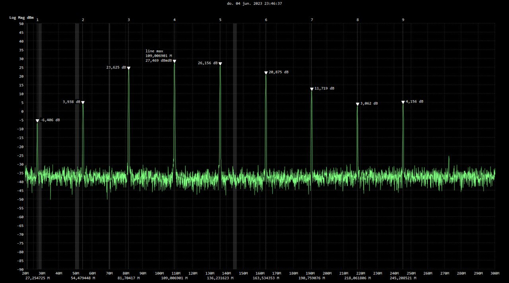
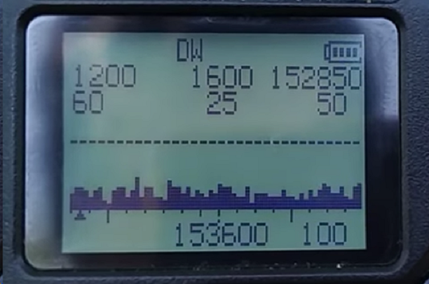
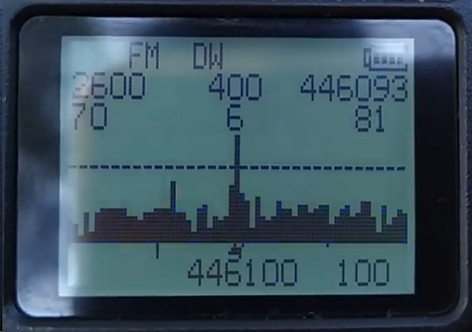
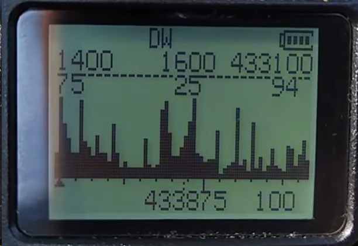
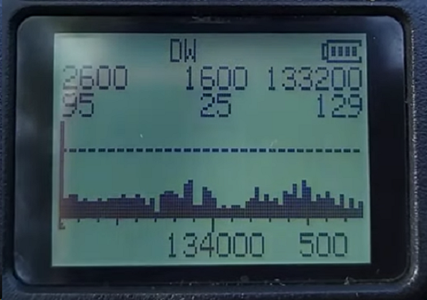

**Advanced spectrum analyzer mod from dkxce.**    
Mod _k5_by_dkxce with Custom Frequency TX/RX: 18..1300 MHz.    
- TX 027 MHz -> 228 microwatts    
- TX 054 Mhz -> 2.4 milliwatts    
- TX 081 Mhz -> 230 milliwatts    
- TX 109 Mhz -> 558 milliwatts    
- TX 136 Mhz -> 412 milliwatts    
- TX 163 Mhz -> 122 milliwatts    
- TX 190 Mhz -> 14.8 milliwatts    
- TX 218 Mhz -> 2 milliwatts    
- TX 245 Mhz -> 2.6 milliwatts
  
Starts with the flashlight button. Before starting, either turn off the noise reduction (SQL to 0) or turn on the monitoring mode.     
- Up / down - frequency change,     
- 1/7 - sensitivity (measurement time),     
- 2/8 - frequency step,     
- 9/3 - zoom in / out,     
- `*`/F (hold) - noise reduction level, 
- 5 - backlight,     
- 0 - ignore frequency,     
- EXIT - exit.     
After exiting, open the menu to refresh the screen.    
   

**Advanced spectrum analyzer.**         
Mods _k5_OnlyReceiverSpectrum, _k5_TXRXSpectrum from https://whosmatt.github.io/uvmod/    
Starts with the flashlight button. Before starting, either turn off the noise reduction (SQL to 0) or turn on the monitoring mode.     
- Up / down - frequency change,     
- 1/7 - sensitivity (measurement time),     
- 2/8 - frequency step,     
- 9/3 - zoom in / out,     
- `*`/ F (hold) - noise reduction level, 
- 5 - backlight,     
- 0 - ignore frequency,     
- EXIT - exit.     
After exiting, open the menu to refresh the screen. By @fagci, v66.    

**Simple spectrum analyzer:**   
Mods _k5_OnlyReceiverSpectrum_Simple, _k5_TXRXSpectrum _Simple from https://whosmatt.github.io/uvmod/     
Starts with the flashlight button.     
- Up / down (hold) - change the center frequency,     
- 1/7 - increase / decrease resolution,     
- 8/2 - zoom in / out,     
PTT / EXIT - exit.     
After exiting, open the menu to refresh the screen. By @piotr022, v78.    

Samples:      
    
    
    
    
    
   
[VIDEO](https://www.youtube.com/playlist?list=PL67vBSofOrHMyXOEhonOzQz5gJzsZFiDq)

**Additional Options:**   
- Custom Battery icon  
- Backlight Duration: 2x - up to 10s backlight      
- Increase Mic Gain    
- Custom Frequency Ranges: 18 - 1300 MHz    
- AM RX on all Bands    
- FM Radio Frequencies: 64 - 108 MHz    
