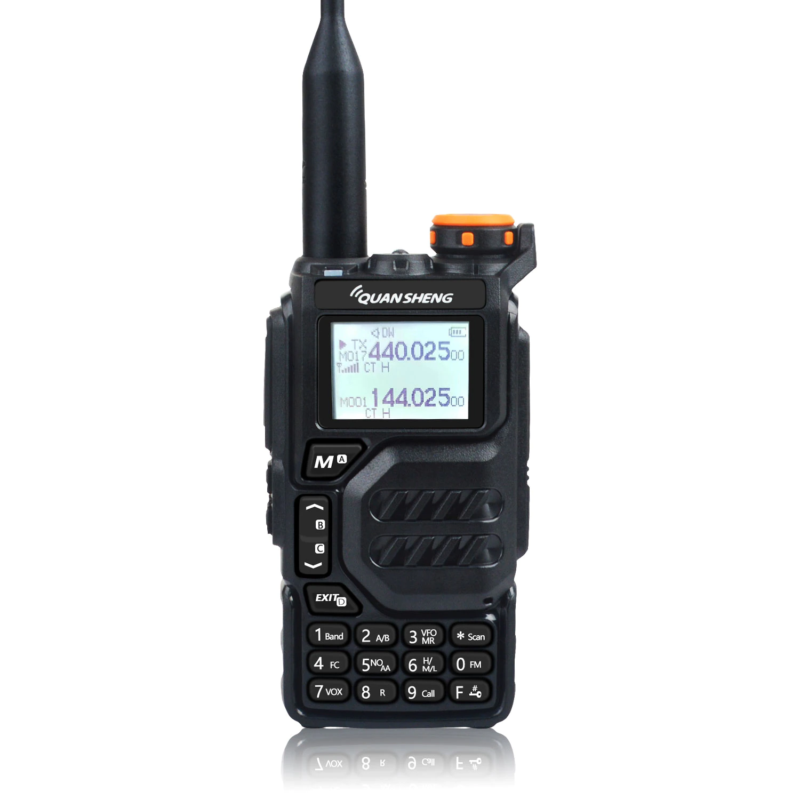
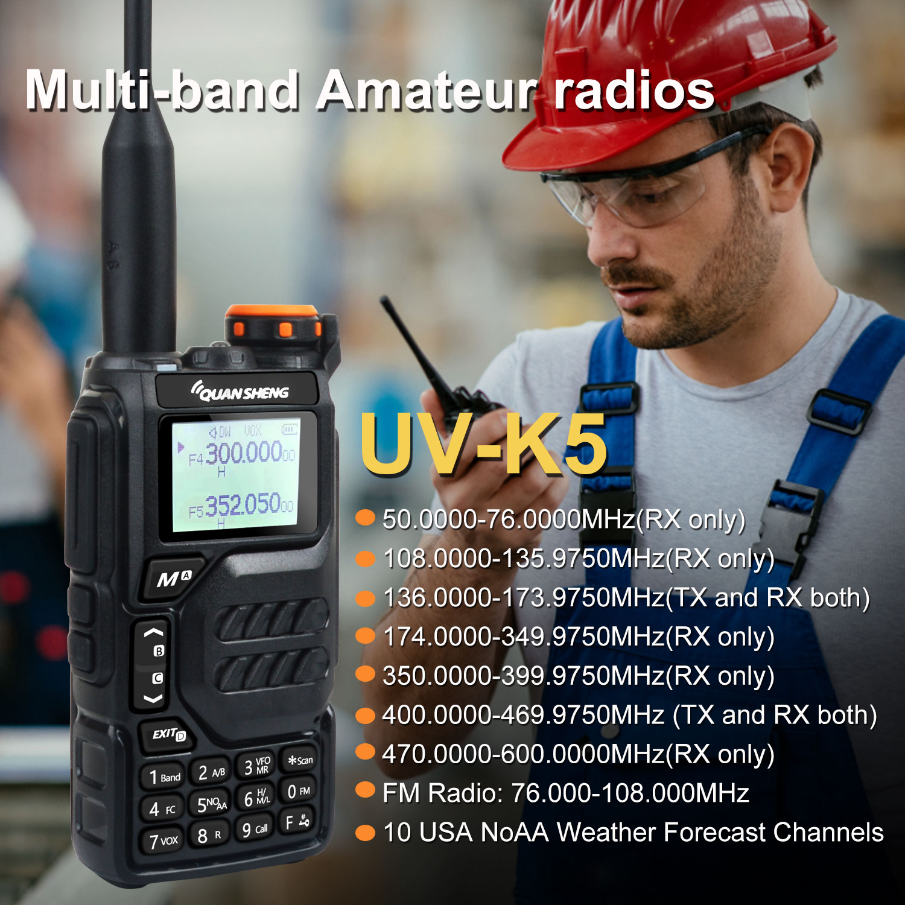
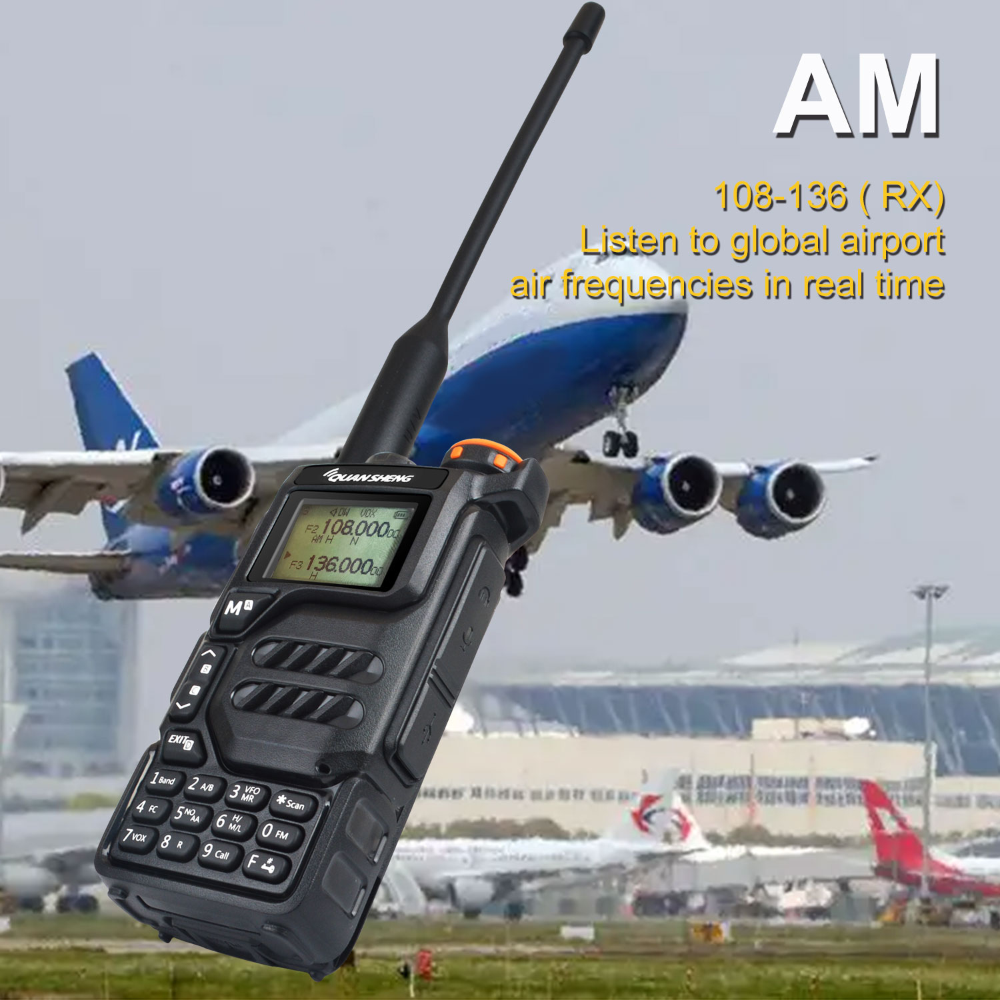
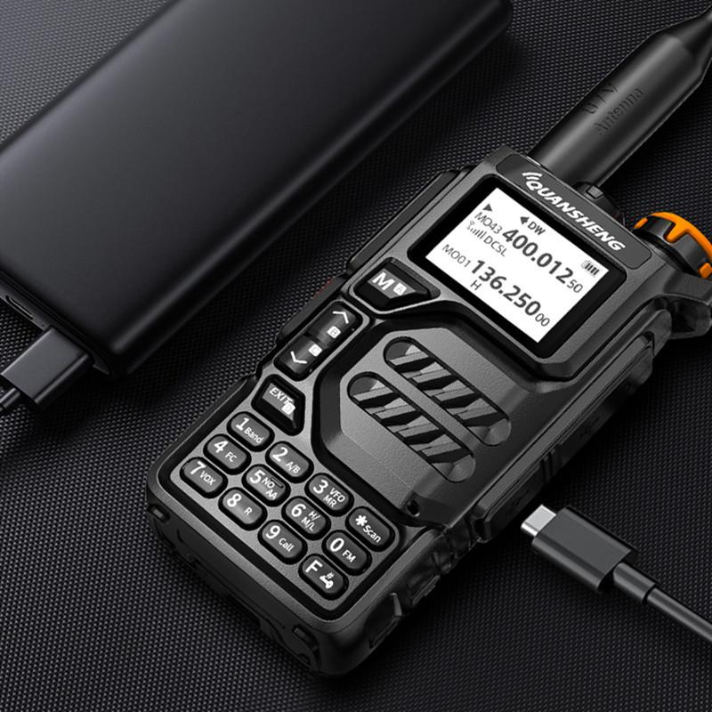
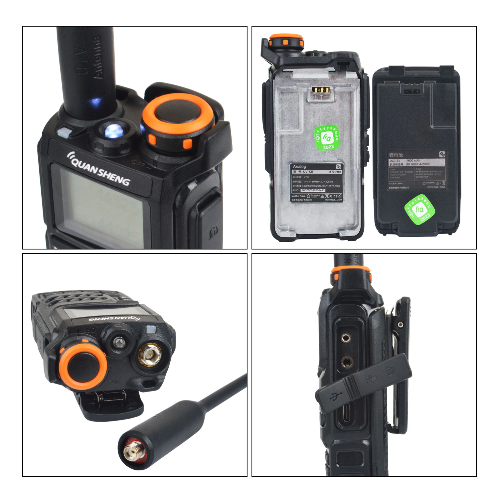
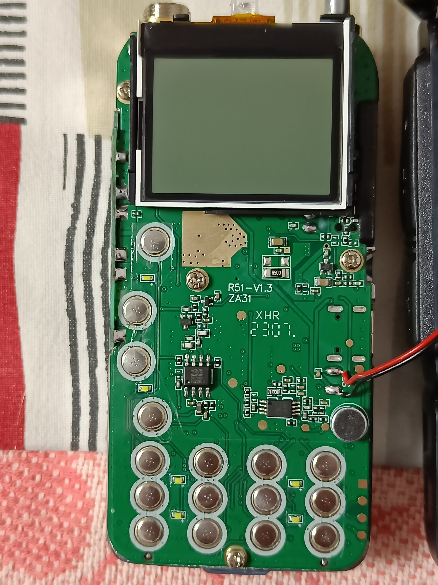
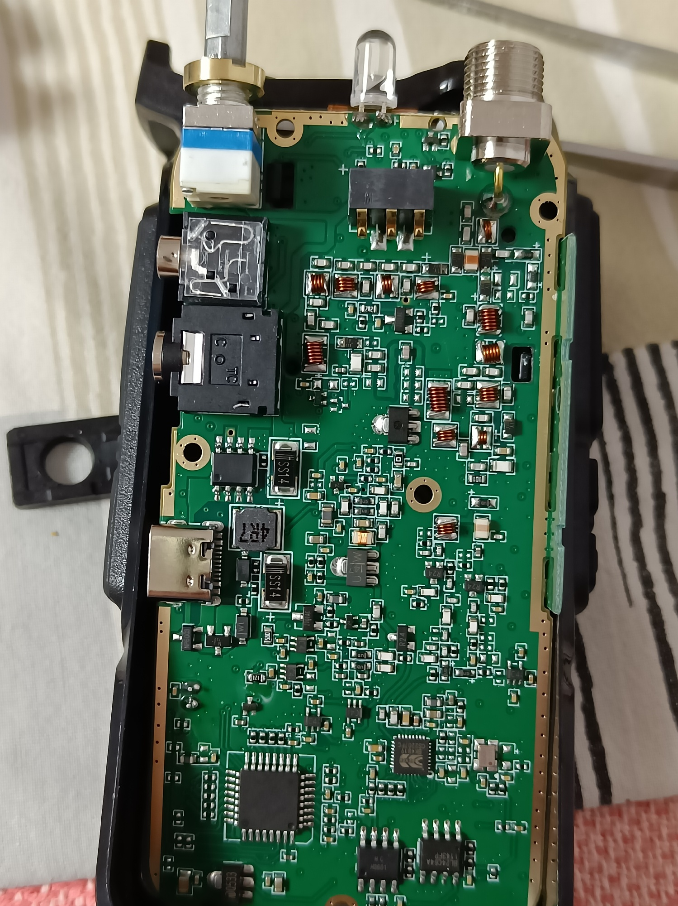

# Quansheng UV-K5

**Frequencies Range**:

    F1: 050.0000 - 76,0000 MHz (RX)
    F2: 108.0000 - 135.9750 MHz (RX AM/FM) - Air Band
    F3: 136.0000 - 173.9750 MHz (TX + RX) - HAM + Sea Bands
    F4: 174.0000 - 349.9750 MHz (TX + RX) - Sea + SatCom + River Bands
    F5: 350.0000 - 399.9750 MHz (TX + RX) - River Bands
    F6: 400.0000 - 469.9750 MHz (TX + RX) - HAM + LPD + PMR Bands
    F7: 470.0000 - 600.0000 MHz (TX + RX)
    FM-Broadcase: 076.000-108.000 МГц

      
      

      
      
      
