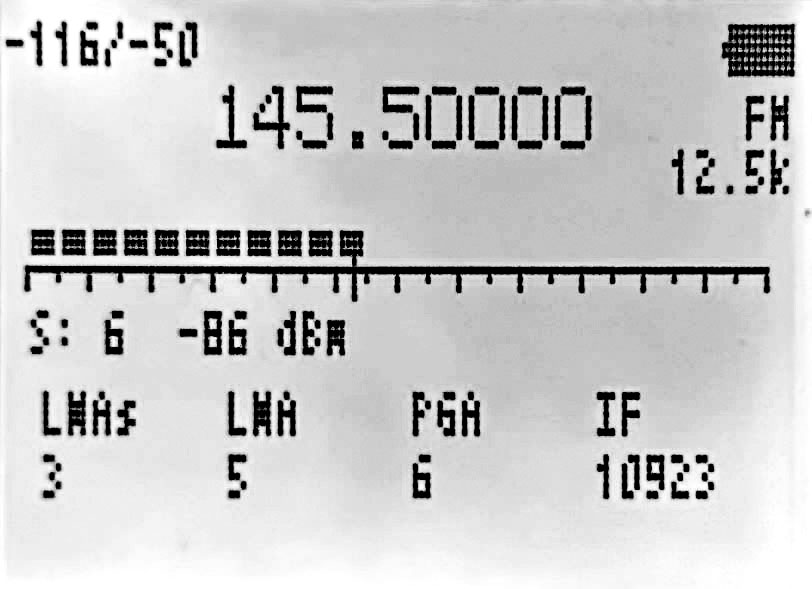

### Open re-implementation of the Quansheng UV-K5/K6/5R v2.1.27 firmware ###

[More Info](https://github.com/egzumer/uv-k5-firmware-custom)    
[More Info, Wiki](https://github.com/egzumer/uv-k5-firmware-custom/wiki)    

## Main features: ##

    - many of OneOfEleven mods:
        - AM fix, huge improvement in reception quality
        - long press buttons functions replicating F+ action
        - fast scanning
        - channel name editing in the menu
        - channel name + frequency display option
        - shortcut for scan-list assignment (long press 5 NOAA)
        - scan-list toggle (long press `* Scan` while scanning)
        - configurable button function selectable from menu
        - battery percentage/voltage on status bar, selectable from menu
        - longer backlight times
        - mic bar
        - RSSI s-meter
        - more frequency steps
        - squelch more sensitive
    - fagci spectrum analyzer (F+5 to turn on)
    - some other mods introduced by me:
        - SSB demodulation (adopted from fagci)
        - backlight dimming
        - battery voltage calibration from menu
        - better battery percentage calculation, selectable for 1600mAh or 2200mAh
        - more configurable button functions
        - long press MENU as another configurable button
        - better DCS/CTCSS scanning in the menu (`* SCAN` while in RX DCS/CTCSS menu item)
        - Piotr022 style s-meter
        - restore initial freq/channel when scanning stopped with EXIT, remember last found transmission with MENU button
        - reordered and renamed menu entries
        - LCD interference crash fix
        - many others...

## Memory-channels scanning: ##

To scan channels saved in the radio memory switch the VFO to Memory mode.

The radio has 2 scanning lists. Each memory-channel can belong to 0, 1 or 2 lists. 
To add/delete a channel to/from a list switch current VFO to desired channel and go to a menu ScAdd1 or ScAdd2, 
alternatively you can long press 5 NOAA button, you will see icons I and II toggling on and off on the right side of the channel label.

If you set up the scanning lists you can start scanning by using custom button scan function or by long pressing `* Scan` button. 
If you press the function button or long press `* Scan` while scanning, the scanning list will be switched, 
you will see corresponding icon on the top left of the screen: 1, 2 or * (star means: All memory channels). 
Active scanning list can also be changed with menu SList. You can view scan lists and its channels by going to menu: SList1 or SList2.

## Scan frequency range function: ##

    - switch to frequency mode
    - set upper and lower VFO frequencies to scan range boundaries
    - long-press `5 NOAA`, `ScnRng` label should show up
    - start scan with long-press `* Scan`
    - it will scan between given boundaries
    - long-press `5 NOAA` or `EXIT`, or switch VFOs to exit ScnRng mode

ScnRng function is also supported by spectrum analyzer. If you activated the function just start spectrum analyzer.

## Spectrum analyzer: ##

Press `F + 5 NOAA` to turn on the Spectrum analyzer.
The current VFO/Memory frequency will be the center frequency of the spectrum sweep.

    `1 / 7` - increases/decreases frequency step between consecutive bars
    `4` - toggles the number of bars (channels) in the graph
    `2 / 8` - increases/decreases frequency step size by which the graph is scrolled with UP/DOWN buttons
    `5` - shows a frequency input box for lower sweep frequency (value in MHz, * - decimal point)
    `3 / 9` - increases/decreases maximum dB value (vertical scale)
    `6` - toggles receiver bandwidth
    `* / F` - increases/decreases squelch level
    `0` - toggles modulation type (FM/AM/USB)
    `Side Button I` - excludes current frequency from the spectrum scan
    `Side Button II` - toggles backlight
    `EXIT` - exits to a previous screen/function
    `PTT` - switches screen to detail monitoring of last received frequency (see below)
	
	
## BROADCAST FM ##

    `F + 0 FM` or long press 0 FM starts broadcast reception
    `Exit` or using above start command, when radio is in FM radio mode, ends broadcast reception
    `F + VFO/MR` or long press `VFO/MR` changes between VFO or memory channels (VFO-/MR-mode)

Pressing `M` in `VFO` mode allows to store the current frequency in a memory channel. Use arrow keys to select memory, confirm with `M`. There are 20 memories available.
In MR-mode pressing `M` allows to delete that memory channel.